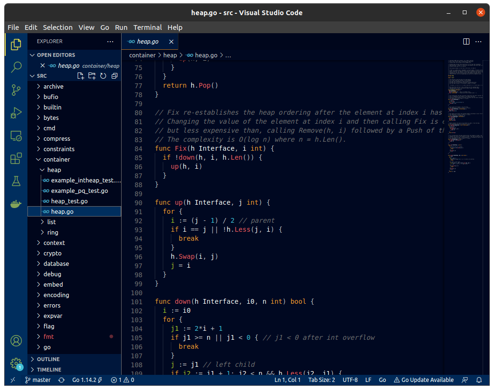
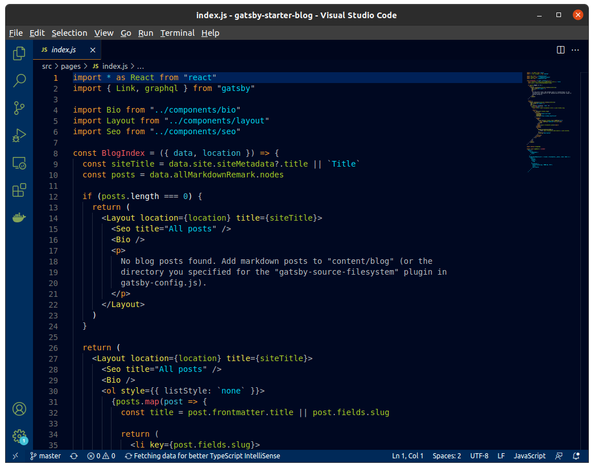
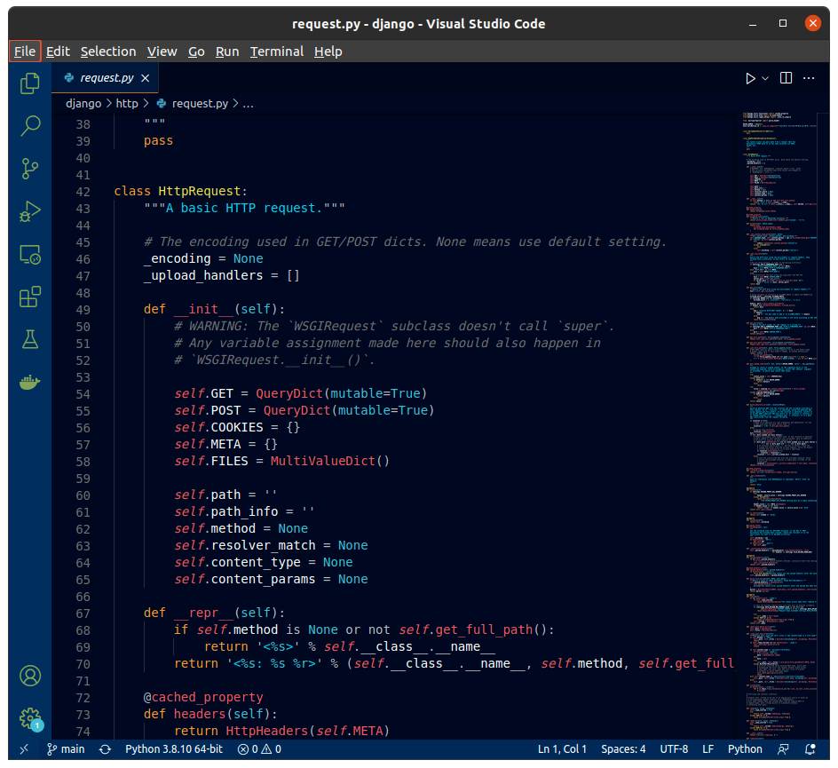

# HINODE: VSCode Color Theme.

Hinode is a beautiful vscode color theme like sunrise.
Hinode(日の出) means sunrise in Japanese.

## Preview

### Go

### JavaScript

### Python

## LICENSE

MIT

### Preview Source code LICENSE

- [go LICENSE](https://github.com/golang/go/blob/master/LICENSE)
- [gatsby-starter-blog LICENSE](https://github.com/gatsbyjs/gatsby-starter-blog/blob/master/LICENSE)
- [django LICENSE](https://github.com/django/django/blob/master/LICENSE)